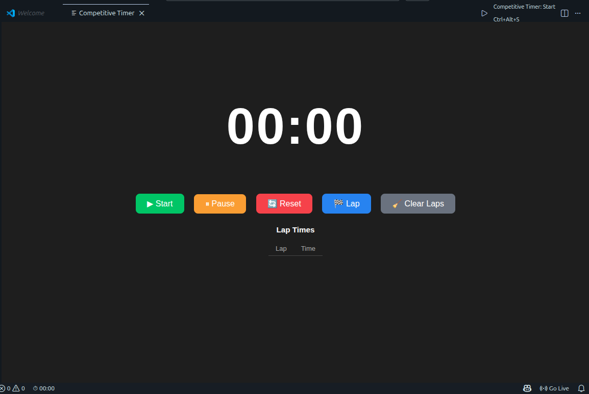
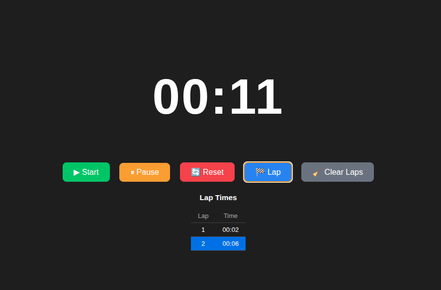
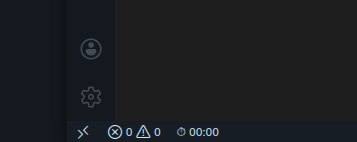

# Competitive Timer ⏱


A lightweight VS Code extension that helps competitive programmers track problem-solving time directly inside the editor.

---
Install

Download the extension:

➡️ Download Competitive Timer

After downloading:

Open VS Code

Go to Extensions

Click ⋯ (three dots)

Select Install from VSIX

Choose the downloaded .vsix file
## Preview

### Timer Interface



### Lap Tracking



### Status Bar Timer



---

## Features

* ⏱ Simple stopwatch timer
* ▶ Start / ⏸ Pause / 🔄 Reset controls
* 🏁 Record lap times for each solved problem
* 📊 Lap history displayed as a table
* ⭐ Latest lap highlighted automatically
* 📜 Auto-scroll lap list
* 🧹 Clear lap history
* 👀 Timer visible in the VS Code status bar

---

## How to Use

### 1. Open the Command Palette

```
Ctrl + Shift + P
```

### 2. Run

```
Competitive Timer: Start
```

### 3. Use the timer controls

* **Start** → Start the timer
* **Pause** → Pause the timer
* **Reset** → Reset the timer
* **Lap** → Record a solve time
* **Clear Laps** → Clear lap history

---

## Why Competitive Timer?

Competitive programmers often want to measure how long each problem takes.

This extension keeps the timer **inside VS Code**, so you don’t need external apps or distractions.

---

## Future Improvements

* Contest mode
* Problem name tracking
* Export lap times
* Better statistics
* More keyboard shortcuts

---

## Author

**AjAnik**

GitHub: https://github.com/Aj-Anik

---

## License

MIT License
